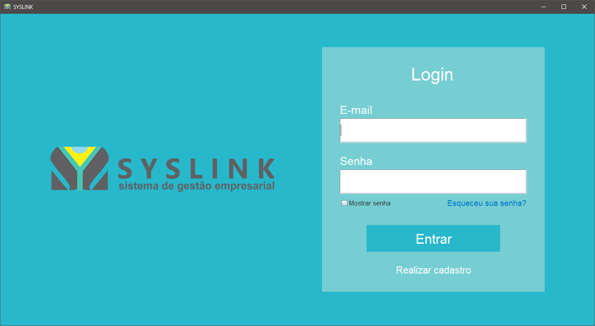

# Syslink

> Versão administrativa de uma aplicação de suporte para a plataforma Syslink.

[![Baixar Aplicação][url-image]][url] [![Syslink Website][url-image2]][url2]

    

## Sobre o Projeto

Uma aplicação que visa o gerenciamento de soluções para erros encontrados na plataforma Syslink. Desenvolvida em Java com interfaces gráficas utilizando Java Swing.

## Como Contribuir

1. Faça um fork do repositório
2. Crie uma branch para sua feature (`git checkout -b feature/MinhaFeature`)
3. Faça commit das suas mudanças (`git commit -am 'Adiciona uma nova feature'`)
4. Faça push para a branch (`git push origin feature/MinhaFeature`)
5. Abra um Pull Request

## Licença

Este projeto está licenciado sob a Licença MIT - veja o arquivo [LICENSE](LICENSE) para detalhes.

## Contato

- Raphael Vilete - [raphvilete@gmail.com](mailto:raphvilete@gmail.com)

<!-- Markdown link & img dfn's -->
[url]: https://github.com/raphss/Syslink/raw/main/dist/Syslink.exe www.syslink.com.br
[url-image]: https://img.shields.io/badge/Live_Website-blue

[url2]: https://www.syslink.com.br
[url-image2]: https://img.shields.io/badge/Live_Website-green
